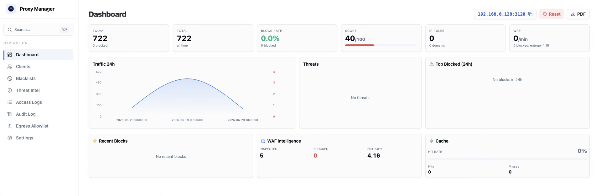
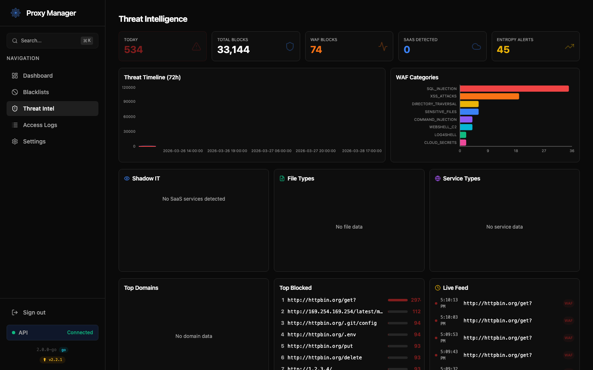
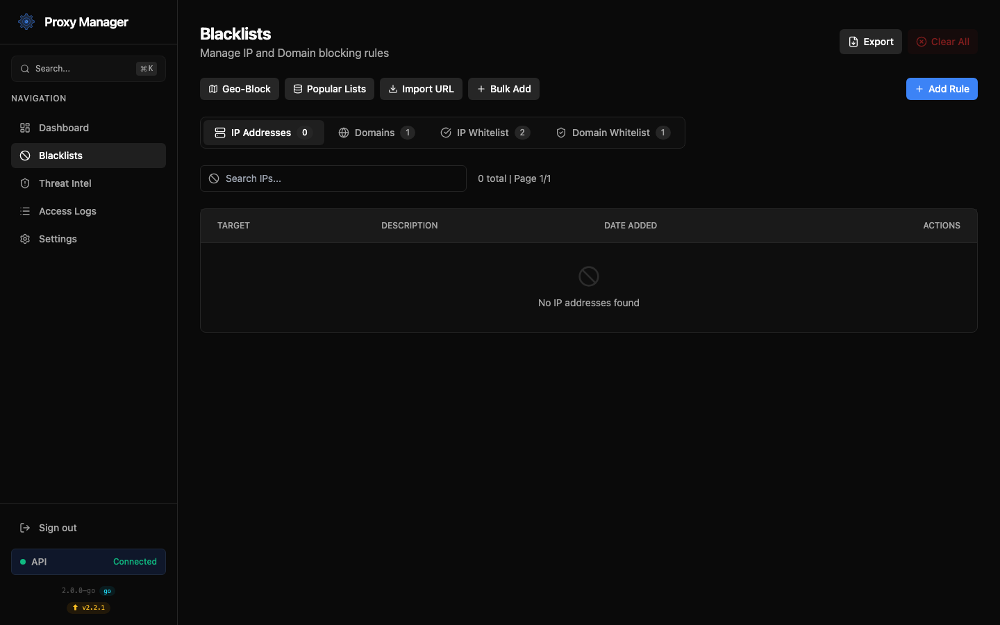
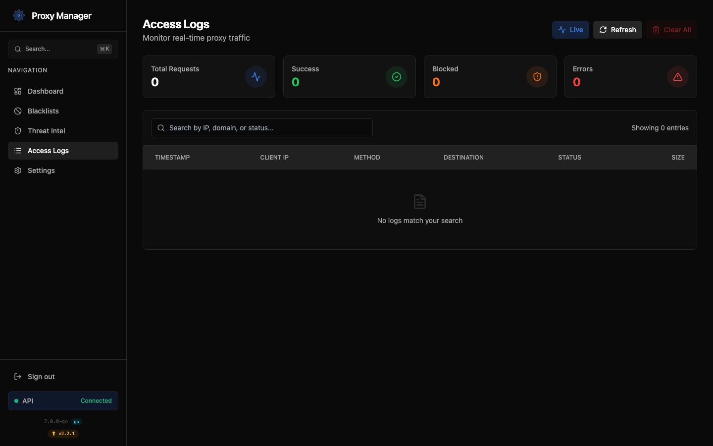
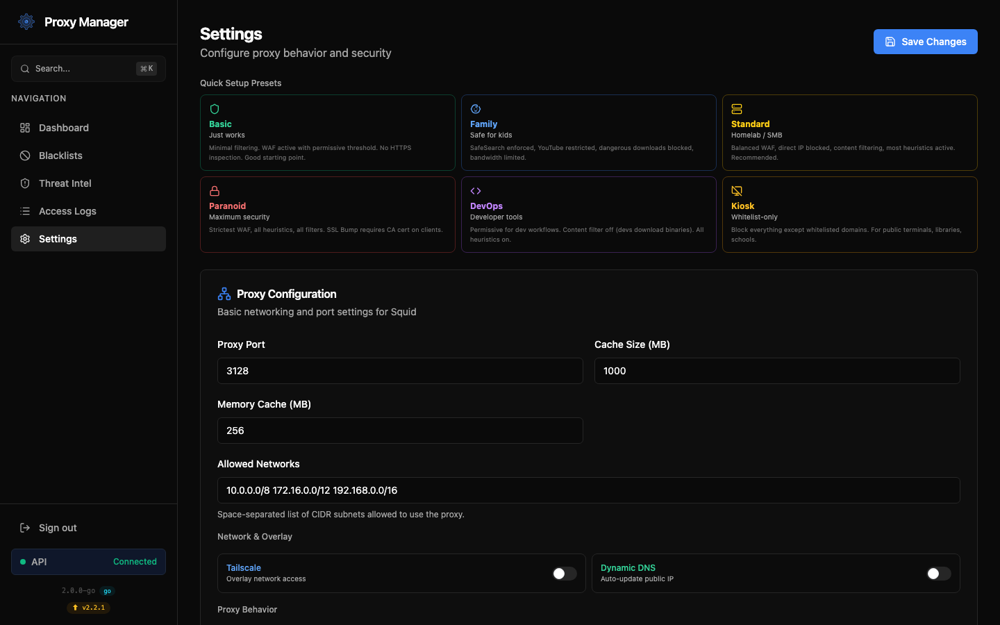

# Secure Proxy Manager

[](https://github.com/fabriziosalmi/secure-proxy-manager/actions/workflows/ci.yml)
[](LICENSE)
[](https://github.com/fabriziosalmi/secure-proxy-manager/releases)
[](backend-go/)
[](waf-go/)
[](docker-compose.yml)

**Monitor and secure all outbound traffic from your network.** Block malicious sites, detect data leaks, catch malware callbacks — with a dashboard you'll actually enjoy using.

Think of it as "Pi-hole + WAF + egress firewall" in one Docker stack. No agents to install on clients — just point your devices to the proxy.

Built for homelab, self-hosted, and SMB. Runs on **Raspberry Pi** (ARM64) and any x86 server.

## Table of Contents

- [Screenshots](#screenshots)
- [Quick Start](#quick-start)
- [Benchmark Results](#benchmark-results)
- [Key Features](#key-features)
- [Architecture](#architecture)
- [Installation](#installation)
- [Configuration](#configuration)
- [FAQ](#faq)

## Screenshots

<div align="center">
  
  <p><em>Dashboard — real-time traffic, threats, WAF intelligence, cache stats</em></p>
</div>

<details>
<summary><strong>More screenshots</strong></summary>

<div align="center">
  
  <p><em>Threat Intel — Shadow IT, file types, service types, domain cloud, regex playground</em></p>
  <br/>
  
  <p><em>Blacklists — 34K+ IPs, 87K+ domains, paginated with search</em></p>
  <br/>
  
  <p><em>Access Logs — real-time WebSocket stream with filtering</em></p>
  <br/>
  
  <p><em>Settings — 6 presets, client setup, notifications, WAF heuristics</em></p>
</div>

</details>

## Quick Start

```bash
# One-command install (any Linux VPS or server)
curl -fsSL https://raw.githubusercontent.com/fabriziosalmi/secure-proxy-manager/main/deploy/install.sh | sudo bash

# Or manually:
git clone https://github.com/fabriziosalmi/secure-proxy-manager.git
cd secure-proxy-manager
cp .env.example .env   # edit credentials
docker compose up -d --build

# Open: https://localhost:8443 (accept self-signed cert)
# Run E2E tests: ./tests/e2e.sh localhost admin password
```

## Benchmark Results

| Metric | Value |
|--------|-------|
| E2E Tests | **104 checks, 99 passed, 0 failed** |
| WAF Rules | **166 regex + 7 heuristic + 3 ML-lite** |
| Security Packs | **21 toggleable categories** |
| Attack Detection | **17/17 (100%)** |
| False Positives | **0/7 (0%)** |
| Evasion Resistance | **5/5 (double-encode, case-mix, null byte, unicode, long payload)** |
| P50 Latency | **107ms** (with full ICAP inspection) |
| Backend Memory | **~20MB** (Go binary) |
| Backend Binary | **16MB** (single file, zero dependencies) |
| Platforms | **linux/amd64 + linux/arm64** (Raspberry Pi) |

## Key Features

### Core
- **Go Backend**: Single 16MB binary, ~20MB RAM. Zero Python dependencies.
- **WAF Engine (Go ICAP)**: 166 regex + 7 heuristics + 3 ML-lite across 21 categories. Anomaly scoring, Shannon entropy, dual-scan (raw + normalized).
- **Security Packs**: 21 toggleable WAF rule categories — enable/disable SQLi, XSS, C2, DLP packs from the API.
- **DNS Blackhole**: dnsmasq blocks 87K+ domains at L3 (zero HTTP overhead).
- **HTTPS by Default**: Self-signed TLS auto-generated. Optional Let's Encrypt with certbot.
- **Multi-Arch**: Runs on x86_64 and ARM64 (Raspberry Pi 4/5).

### Intelligence
- **ML-Lite Detection**: DGA domains (bigram analysis), typosquatting (Levenshtein + homoglyph), safe URL cache.
- **Threat Intel Dashboard**: Shadow IT (35+ SaaS), file types, service types, domain cloud, live feed.
- **Regex Playground**: Test new WAF rules against real traffic before deploying.
- **Squid CVE Alert**: Detects known vulnerabilities in your Squid version.
- **Update Notifier**: Checks GitHub releases, shows badge when update available.

### Onboarding & UX
- **Glass Morphism UI**: Aerospace-grade dark theme with `backdrop-blur` glass surfaces, animated number counters, staggered page transitions, progress bar glow, and frosted ⌘K search modal.
- **Setup Wizard**: First-login 3-step wizard (environment → devices → strictness).
- **6 Presets**: Basic, Family, Standard, Paranoid, DevOps, Kiosk — one-click configuration.
- **Client Setup Export**: Per-OS instructions (Win/Mac/Linux/iOS/Android) + PAC file download.
- **WPAD Auto-Discovery**: Browsers auto-detect proxy via `wpad.dat` — zero client config.
- **Extra SSL Ports**: Allow HTTPS CONNECT on non-standard ports (e.g. Proxmox 8006, Grafana 3000) from Settings.
- **Pi-hole/AdGuard Detect**: Scans LAN for existing DNS providers, offers to cooperate.
- **DoH Blocker**: Blocks 14 DNS-over-HTTPS providers to prevent blackhole bypass.
- **GDPR Mode**: Anonymize client IPs in logs (last octet → x) for EU compliance.

### Security Hardening (v3.1)
- **Encryption at Rest**: Sensitive settings (webhook URLs, API tokens) encrypted with AES-256-GCM in the database.
- **Persistent JWT Blacklist**: Revoked tokens survive container restarts via SQLite persistence.
- **Global Rate Limiting**: Token bucket per-IP (20 req/s, burst 60) on all endpoints.
- **Circuit Breaker**: WAF calls protected against cascading failures (auto-recovery).
- **Notification Retry**: Failed deliveries retry 3x with exponential backoff.
- **Tightened CSP**: Removed `unsafe-eval`, restricted `connect-src` to self + WebSocket.
- **pprof Profiling**: Auth-protected `/debug/pprof/*` endpoints for production debugging.
- **CI Security Scanning**: gosec + npm audit + backend test coverage threshold in GitHub Actions.

### Operations
- **One-Click Deploy**: `curl | bash` installer + cloud-init YAML for Hetzner/DO/Linode.
- **API Documentation**: `GET /api/docs` — 60+ endpoints with descriptions.
- **E2E Test Suite**: 104 checks across 3 parts — `./tests/e2e.sh host user pass`.
- **Notifications**: Telegram, Discord, Gotify, ntfy.sh, MS Teams, custom webhook — with retry and backoff.
- **Protocol Hardening**: Method whitelist, header stripping, HSTS, max header size.
- **Audit Trail**: Who changed what, when — `/api/audit-log`.
- **Blocklists**: 16 popular sources, geo-blocking, paginated UI with search.
- **Custom Block Pages**: Branded dark-theme error pages.

## Architecture

The project employs a microservices architecture:

1. **Frontend (React 19/Vite/Nginx)**: Glass morphism design system with animated counters, staggered transitions, and frosted overlays. SPA with @tanstack/react-query, Recharts dashboards, paginated blacklists, Threat Intel page with Shadow IT/file types/domain cloud, global search (⌘K), mobile responsive.
2. **Backend (Go)**: Single 16MB binary (chi router, zerolog, modernc/sqlite). 70+ endpoints, WebSocket log streaming, JWT auth + persistent blacklist, AES-256-GCM encrypted settings, global rate limiting, circuit breaker for WAF calls, pprof profiling, audit logging, SSRF-safe HTTP client with DNS pinning.
3. **Proxy Engine (Squid 5.9)**: Caching/filtering with ICAP integration, custom branded block pages, IP ACL blocking, protocol hardening (method whitelist, header stripping, HSTS).
4. **WAF Engine (Go ICAP)**: 166 regex rules + 7 behavioral heuristics + 3 ML-lite checks (DGA, typosquatting, safe URL cache). Anomaly scoring, Shannon entropy, dual-scan (raw + normalized).
5. **DNS Blackhole (dnsmasq)**: Internal DNS resolver that sinkhole-blocks 87K+ blacklisted domains at L3. Supports 600K+ entry blocklists with tuned memory and healthcheck timing.
6. **Tailscale Sidecar** (optional): Secure remote access overlay network.

<div align="center">
  
</div>

### Project Structure

```
secure-proxy-manager/
├── backend-go/               # Go backend (v2.0 — replaces Python)
│   ├── cmd/server/main.go    # Entry point, router, graceful shutdown
│   └── internal/
│       ├── auth/             # JWT + Basic Auth, rate limiting, persistent token blacklist
│       ├── config/           # Environment-based configuration + key management
│       ├── crypto/           # AES-256-GCM encryption for sensitive settings
│       ├── database/         # SQLite WAL, schema, migrations, atomic exports
│       ├── docker/           # Docker API client (Squid/dnsmasq signaling)
│       ├── handlers/         # HTTP handlers (auth, blacklists, analytics, etc.)
│       ├── middleware/       # CORS, rate limiting, circuit breaker, security headers
│       ├── websocket/        # WebSocket hub with client lifecycle
│       └── workers/          # Background: log tailing, retention, auto-refresh (context-aware)
├── backend/                  # Python backend (legacy, kept for reference)
├── ui/                       # React 19 frontend
│   └── src/
│       ├── pages/            # Dashboard, Blacklists, ThreatIntel, Logs, Settings, Login
│       ├── hooks/            # useAnimatedNumber (rAF counter interpolation)
│       ├── lib/api.ts        # Axios + JWT expiry + react-query
│       └── public/logo.svg   # Gear+eye SVG logo
├── proxy/                    # Squid proxy service
│   ├── startup.sh            # Config generator with IP blocking + dnsmasq wiring
│   └── error-pages/          # Custom branded dark-theme block pages
├── waf-go/                   # Go ICAP WAF engine (10 modules)
│   ├── main.go               # ICAP handlers, safe URL cache integration
│   ├── rules.go              # 166 regex rules across 21 categories
│   ├── heuristics.go         # 7 behavioral anomaly detection rules
│   ├── bloom.go              # Safe URL cache (skip regex for known-clean URLs)
│   ├── dga.go                # DGA domain detection (bigram + entropy analysis)
│   ├── typosquat.go          # Typosquatting detection (Levenshtein + homoglyphs)
│   ├── entropy.go            # Shannon entropy, JSONL traffic profiler
│   ├── stats.go              # Real-time metrics collector
│   ├── normalize.go          # Anti-evasion input normalization (dual-scan)
│   ├── fuzz_test.go          # Evasion + false positive + stability fuzzing
│   └── main_test.go          # 80+ test cases + benchmarks
├── dns/                      # dnsmasq DNS blackhole sidecar
│   ├── dnsmasq.conf          # Upstream DNS + blocklist include
│   └── Dockerfile
├── scripts/
│   └── benchmark.sh          # 360-degree reproducible benchmark suite
├── config/                   # Shared volumes (blacklists, SSL, dnsmasq)
├── data/                     # SQLite DB + WAF traffic JSONL
├── BENCHMARKS.md             # Live performance & security results
├── CHANGELOG.md
├── docker-compose.yml        # 6-service stack (Go backend)
├── deploy/install.sh         # One-command installer for any VPS
└── tests/e2e.sh              # 104-check E2E test suite
```

## Installation

### Requirements
- Docker 20.10+ with Compose v2
- 1 CPU, 512MB RAM, 2GB disk

### Ports used
| Port | Service | Required |
|------|---------|----------|
| 443 / 8443 | HTTPS (Web UI) | ✅ |
| 80 / 8011 | HTTP (redirect + ACME) | ✅ |
| 3128 | Proxy (configure clients here) | ✅ |
| 5001 | Backend API (WebSocket) | Optional |

### Option A: One-command install (recommended)
```bash
curl -fsSL https://raw.githubusercontent.com/fabriziosalmi/secure-proxy-manager/main/deploy/install.sh | sudo bash
```
This installs Docker if needed, generates random credentials, builds, and starts everything.

### Option B: Manual setup
```bash
git clone https://github.com/fabriziosalmi/secure-proxy-manager.git
cd secure-proxy-manager
cp .env.example .env
nano .env                    # set BASIC_AUTH_USERNAME and BASIC_AUTH_PASSWORD
docker compose up -d --build
```

### First login
1. Open **https://localhost:8443** (accept the self-signed certificate)
2. Log in with the credentials from `.env`
3. The **Setup Wizard** guides you through configuration (choose preset, devices, strictness)
4. Configure client devices: set proxy to `your-server-ip:3128`

### Updating
```bash
cd secure-proxy-manager
git pull
docker compose up -d --build
```
   docker compose up -d
   ```

### Need Help?

- **New to Docker?** See our comprehensive [DEPLOYMENT.md](DEPLOYMENT.md) guide
- **Encountering issues?** Check the [Troubleshooting](#troubleshooting) section below
- **Want detailed setup instructions?** Read the full [Deployment Guide](DEPLOYMENT.md)

## Configuration Options

### Environment Variables

#### Backend Service Variables
| Variable | Description | Default | Used By |
|----------|-------------|---------|---------|
| `BASIC_AUTH_USERNAME` | HTTP Basic Auth username | required | Backend, UI, WAF |
| `BASIC_AUTH_PASSWORD` | HTTP Basic Auth password | required | Backend, UI, WAF |
| `DATABASE_PATH` | Path to SQLite database file | `/data/secure_proxy.db` | Backend |
| `PROXY_HOST` | Squid proxy hostname (Docker service name) | `proxy` | Backend |
| `PROXY_PORT` | Squid proxy port | `3128` | Backend |
| `CORS_ALLOWED_ORIGINS` | Comma-separated list of allowed CORS origins | `http://localhost:8011,http://web:8011` | Backend |
| `PROXY_CONTAINER_NAME` | Docker container name for proxy | `secure-proxy-manager-proxy` | Backend |

#### Web UI Service Variables
| Variable | Description | Default | Notes |
|----------|-------------|---------|-------|
| `BACKEND_URL` | Backend API URL | `http://backend:5000` | Internal Docker network |
| `REQUEST_TIMEOUT` | API request timeout (seconds) | `30` | Increase for slow networks |
| `MAX_RETRIES` | Maximum API retry attempts | `5` | For backend connection |
| `BACKOFF_FACTOR` | Retry backoff multiplier | `1.0` | Exponential backoff |
| `RETRY_WAIT_AFTER_STARTUP` | Wait time after startup (seconds) | `10` | Initial backend wait |

**Note:** To customize these values, modify them in `docker-compose.yml` before starting the services.

### Security Configuration

**Security Considerations:**

1. **Set Credentials**: `BASIC_AUTH_USERNAME` and `BASIC_AUTH_PASSWORD` must be set before starting. There are no built-in defaults — the services refuse to start if these are empty or set to `admin`.
   ```yaml
   # In .env:
   BASIC_AUTH_USERNAME=your_username
   BASIC_AUTH_PASSWORD=your_password
   ```

2. **HTTPS for Web UI**: For production deployments, use a reverse proxy (e.g., nginx, Traefik) with SSL/TLS to secure the web interface.

3. **Network Isolation**: Consider running the proxy in an isolated network segment with strict firewall rules.

4. **Regular Updates**: Keep the system and Docker images updated with security patches.

5. **Audit Logs**: Regularly review access logs and security events for suspicious activity.

### Security Features

| Feature | Description | Configuration |
|---------|-------------|--------------|
| IP Blacklisting | Block specific IP addresses or ranges | Web UI > Blacklists > IP |
| Domain Blacklisting | Block specific domains (wildcard support) | Web UI > Blacklists > Domains |
| Content Filtering | Block specific file types | Web UI > Settings > Filtering |
| HTTPS Filtering | Inspect and filter HTTPS traffic | Web UI > Settings > Security |
| Global Rate Limiting | Token bucket per-IP (20 req/s, burst 60) | Auto-configured |
| Encryption at Rest | Sensitive tokens/URLs encrypted with AES-256-GCM | Auto-configured |
| JWT Blacklist | Persistent across restarts via SQLite | Auto-configured |
| Circuit Breaker | WAF calls protected against cascading failures | Auto-configured |
| Security Scanning | gosec + npm audit in CI pipeline | `.github/workflows/ci.yml` |

### Performance Tuning

| Setting | Description | Default | Recommended |
|---------|-------------|---------|------------|
| Cache Size | Disk space allocated for caching | 1GB | 5-10GB for production |
| Max Object Size | Maximum size of cached objects | 50MB | 100MB for media-heavy usage |
| Connection Timeout | Timeout for stalled connections | 30s | 15-60s based on network |
| DNS Timeout | Timeout for DNS lookups | 5s | 3-10s based on DNS infrastructure |
| Max Connections | Maximum concurrent connections | 100 | 100-500 based on hardware |

## Advanced Configuration

### Custom SSL Certificate

For HTTPS filtering with your own certificate:

1. Place your certificate and key in the `config/` directory:
   - `ssl_cert.pem`: Your SSL certificate
   - `ssl_key.pem`: Your private key

2. Enable HTTPS filtering in the web interface:
   - Settings > Security > Enable HTTPS Filtering

3. **Important:** Install the certificate on all client devices to avoid browser security warnings
   - **Windows**: Import to Trusted Root Certification Authorities
   - **macOS**: Add to Keychain and trust for SSL
   - **Linux**: Copy to `/usr/local/share/ca-certificates/` and run `update-ca-certificates`
   - **Mobile**: Email the certificate and install via device settings

**Note:** HTTPS filtering performs man-in-the-middle inspection. Only use this feature in environments where you have authorization to inspect traffic (e.g., corporate networks, your own devices).

### Transparent Proxy Setup

To use Secure Proxy as a transparent proxy:

1. Configure iptables on your router/gateway:
   ```bash
   iptables -t nat -A PREROUTING -i eth0 -p tcp --dport 80 -j REDIRECT --to-port 3128
   iptables -t nat -A PREROUTING -i eth0 -p tcp --dport 443 -j REDIRECT --to-port 3129
   ```

2. Enable transparent proxy mode in the web interface:
   - Settings > Advanced > Transparent Mode

### Extending Blacklists

Integrate with external threat intelligence sources. The system supports importing plain text files (one entry per line) and JSON formats.

#### 1-Click Popular Lists Import

The "Popular Lists" button in the Web UI imports well-known public blocklists directly:

**For Domains:**
- *StevenBlack Ad/Malware*: Consolidated host files from multiple sources
- *MalwareDomainList*: Domains known to host malware
- *Phishing Army*: Domains actively involved in phishing

**For IPs:**
- *Firehol Level 1*: A general purpose blocklist protecting against active threats
- *Spamhaus DROP*: Don't Route Or Peer Lists (Direct malware/botnets)
- *Emerging Threats*: Known compromised hosts and botnet C&C

#### Manual Import from URL

```bash
AUTH="Authorization: Basic $(echo -n YOUR_USER:YOUR_PASS | base64)"

# Import domains from URL (plain text, one domain per line)
curl -X POST https://localhost:8443/api/blacklists/import \
  -H "Content-Type: application/json" \
  -H "$AUTH" \
  -d '{"type": "domain", "url": "https://example.com/domain-blacklist.txt"}'

# Import domains from inline content
curl -X POST https://localhost:8443/api/blacklists/import \
  -H "Content-Type: application/json" \
  -H "$AUTH" \
  -d '{"type": "domain", "content": "example.com\n*.badsite.org\nmalicious.net"}'
```

#### Import IP Blacklists

```bash
AUTH="Authorization: Basic $(echo -n YOUR_USER:YOUR_PASS | base64)"

# Import IPs from URL
curl -X POST https://localhost:8443/api/blacklists/import \
  -H "Content-Type: application/json" \
  -H "$AUTH" \
  -d '{"type": "ip", "url": "https://example.com/ip-blacklist.txt"}'

# Import IPs from inline content with CIDR notation support
curl -X POST https://localhost:8443/api/blacklists/import \
  -H "Content-Type: application/json" \
  -H "$AUTH" \
  -d '{"type": "ip", "content": "192.168.1.100\n10.0.0.5\n172.16.0.0/24"}'
```

#### Supported File Formats

- **Plain Text**: One entry per line (recommended for most blacklists)
- **JSON Array**: `["example.com", "malicious.net"]`  
- **JSON Objects**: `[{"domain": "example.com", "description": "Blocked site"}]`
- **Comments**: Lines starting with `#` are ignored

**Note:** For scheduled automatic blacklist updates, consider setting up a cron job or scheduled task that calls the import endpoints with your preferred blacklist sources.

## Monitoring and Analytics

### Dashboard Metrics

- **Proxy Status**: Operational status
- **Traffic Statistics**: Request volume over time
- **Resource Usage**: Memory and CPU consumption
- **Cache Performance**: Hit ratio and response time
- **Security Score**: Security assessment

### Logging and Analysis

All proxy traffic is logged and can be analyzed in the web interface:

- **Real-Time WebSockets**: View access logs streaming live from Squid to the UI via Go WebSocket server.
- **Persistent Storage**: Logs are automatically written to the SQLite database (in WAL mode for concurrency) allowing historical search and pagination.
- **Quick Stats**: Instant metric cards showing Total Requests, Success rates, Blocked traffic, and Errors directly above the logs table.
- **Security Events**: Authentication attempts and blocked requests by the WAF.

### Health Checks

Health status endpoints are available for monitoring:

```bash
curl -I http://localhost:8011/health
```

## Database Export and Backup

### Database Export

Export database contents including blacklists, settings, and logs (limited to 10,000 most recent entries):

1. Via API:
   ```bash
   curl -X GET https://localhost:8443/api/database/export \
     -H "Authorization: Basic $(echo -n YOUR_USER:YOUR_PASS | base64)" \
     > secure-proxy-export.json
   ```

2. Via Direct Backend Access:
   ```bash
   curl -X GET http://localhost:5001/api/database/export \
     -H "Authorization: Basic $(echo -n YOUR_USER:YOUR_PASS | base64)" \
     > secure-proxy-export.json
   ```

### Manual Database Backup

For complete database backup including all logs:

```bash
# Stop the services
docker compose down

# Backup the database file
cp data/secure_proxy.db data/secure_proxy.db.backup

# Backup configuration files
tar -czf config-backup.tar.gz config/

# Restart services
docker compose up -d
```

### Database Restore

To restore from a manual backup:

```bash
# Stop the services
docker compose down

# Restore the database file
cp data/secure_proxy.db.backup data/secure_proxy.db

# Restore configuration files
tar -xzf config-backup.tar.gz

# Restart services
docker compose up -d
```

### Database Optimization

Optimize database performance:

```bash
curl -X POST https://localhost:8443/api/database/optimize \
  -H "Authorization: Basic $(echo -n YOUR_USER:YOUR_PASS | base64)"
```

### Database Statistics

Get database size and statistics:

```bash
curl -X GET https://localhost:8443/api/database/stats \
  -H "Authorization: Basic $(echo -n YOUR_USER:YOUR_PASS | base64)"
```

## Testing and Validation

### Basic Connectivity Test

```bash
curl -x http://localhost:3128 http://example.com
```

### SSL Inspection Test

```bash
curl -x http://localhost:3128 https://example.com --insecure
```

### Blacklist Testing

To test if blacklisting works:
1. Add an IP or domain to the blacklist
2. Attempt to access a resource from that IP or domain
3. Verify the request is blocked (check logs)

### Running the E2E Test Suite

Run the comprehensive 108-check test suite against a live deployment:

```bash
# Full E2E: connectivity, WAF attacks, false positives, CRUD, settings, ML detection
./tests/e2e.sh <HOST> <USER> <PASSWORD>

# Example
./tests/e2e.sh 192.168.100.253 admin mypassword
```

The test suite covers:
- **Part A (Client)**: Proxy connectivity, 17 WAF attack vectors, 7 false positive checks, protocol hardening, latency
- **Part B (Admin)**: Auth, 9 analytics endpoints, blacklist CRUD, settings, feature toggles, maintenance, database
- **Part C (Advanced)**: Settings CRUD persistence, response body validation, WAF evasion (5 vectors), DGA/typosquatting detection, concurrent stress (10 parallel), error handling

### Running WAF Unit Tests

```bash
cd waf-go && go test -v -count=1
```

## Frequently Asked Questions (FAQ)

### General Questions

**Q: What is Secure Proxy Manager?**  
A: It's a containerized web proxy solution built on Squid with a modern management interface for filtering, monitoring, and controlling web traffic.

**Q: Is this suitable for production use?**  
A: Yes, but ensure you follow security best practices, change default credentials, and properly configure SSL certificates for HTTPS filtering.

**Q: Can I use this in a corporate environment?**  
A: Yes. It supports authentication, IP/domain blacklisting, and detailed logging. Ensure compliance with your organization's acceptable-use policies before deployment.

### Installation & Setup

**Q: Which ports need to be open?**  
A: Port 8011 (Web UI), 3128 (Proxy), and optionally 5001 (Backend API for direct access).

**Q: Can I change the default credentials?**  
A: Yes! Modify `BASIC_AUTH_USERNAME` and `BASIC_AUTH_PASSWORD` in `docker-compose.yml` before starting the services.

**Q: How do I update to the latest version?**  
A:
```bash
git pull
docker compose down
docker compose build --no-cache
docker compose up -d
```

### Features & Usage

**Q: How do I import a large blacklist?**
A: Use the import endpoint with a URL pointing to your blacklist file:
```bash
curl -X POST https://localhost:8443/api/blacklists/import \
  -H "Content-Type: application/json" \
  -H "Authorization: Basic $(echo -n YOUR_USER:YOUR_PASS | base64)" \
  -d '{"type": "domain", "url": "https://example.com/blacklist.txt"}'
```

**Q: Does it support IPv6?**  
A: Yes, IPv6 addresses can be added to the IP blacklist, including CIDR notation.

**Q: Can I filter HTTPS traffic?**  
A: Yes, by enabling HTTPS filtering and installing the SSL certificate on client devices. Note: This performs man-in-the-middle inspection.

**Q: How do I view blocked requests?**  
A: Check the logs in the Web UI dashboard or query via API: `https://localhost:8443/api/logs/stats`

### Performance & Scaling

**Q: What are the resource requirements?**  
A: Minimum 1 CPU core and 1GB RAM. For production with heavy traffic, 2+ CPU cores and 4GB+ RAM recommended.

**Q: Can I run multiple instances?**  
A: Yes, you can deploy multiple instances behind a load balancer for high availability.

**Q: How much disk space does caching use?**  
A: Default is 1GB. Adjust the cache size in performance tuning settings based on your needs (5-10GB recommended for production).

### Troubleshooting

**Q: Services won't start - what should I check?**  
A:
1. Run the initialization script: `make setup`
2. Ensure Docker and Docker Compose are installed and running
3. Check for port conflicts: `docker compose logs`
4. Verify volumes have correct permissions: `chmod 755 config data logs`
5. Wait for backend health check (may take 10-15 seconds)
6. See the comprehensive [Deployment Guide](DEPLOYMENT.md#troubleshooting) for detailed solutions

**Q: Getting permission errors with config/data/logs directories?**
A: Run the initialization script (`make setup`) or manually create directories with proper permissions:
```bash
mkdir -p config data logs
chmod 755 config data logs
```

**Q: Authentication is failing between services?**
A: Ensure you have a `.env` file with credentials set. Copy from `.env.example`:
```bash
cp .env.example .env
docker compose restart
```

**Q: Why am I getting SSL certificate warnings?**  
A: The SSL certificate needs to be installed on each client device. See [Custom SSL Certificate](#custom-ssl-certificate) section.

**Q: Import is failing - what's wrong?**  
A: Common causes:
- Invalid format (ensure one entry per line or valid JSON)
- Network issues (URL not accessible)
- Authentication failure (check credentials)
- Check logs: `docker compose logs backend`

## Troubleshooting

### Quick Fixes

**First-Time Setup Issues?** 
- Run the initialization script: `make setup`
- Or manually: `mkdir -p config data logs && cp .env.example .env && docker compose up -d`

**For detailed troubleshooting and step-by-step solutions, see the [Deployment Guide](DEPLOYMENT.md#troubleshooting).**

### Common Issues

| Issue | Possible Cause | Resolution |
|-------|---------------|------------|
| Cannot access web UI | Port conflict or service not started | Run `make setup`, check `docker compose ps` |
| Permission denied errors | Missing directories or wrong permissions | Run `make setup` or `mkdir -p config data logs && chmod 755 config data logs` |
| Authentication failures | Missing .env file | Copy `.env.example` to `.env` and restart |
| Proxy not filtering | Incorrect network configuration | Verify client proxy settings |
| SSL warnings | Certificate not trusted | Install certificate on client devices |
| Performance issues | Insufficient resources | Increase container resource limits |
| Database errors | Permission issues | Check volume permissions with `ls -la data/` |

### Diagnostic Tools

1. **Service Logs**:
   ```bash
   docker compose logs -f backend
   docker compose logs -f ui
   docker compose logs -f proxy
   ```

2. **Database Check**:
   ```bash
   docker compose exec backend sqlite3 /data/secure_proxy.db .tables
   ```

3. **Network Validation**:
   ```bash
   docker compose exec proxy ping -c 3 google.com
   ```

4. **Cache Analysis**:
   ```bash
   docker compose exec proxy squidclient -h localhost mgr:info
   ```

## API Documentation

Secure Proxy Manager provides a RESTful API for integration and automation with support for plain text and JSON blacklist imports.

**API Base URLs:**
- Via Web UI: `https://localhost:8443/api`
- Direct Backend Access: `http://localhost:5001/api`

**Note:** When accessing the API directly through the backend (port 5001), you bypass the Web UI layer. This can be useful for automation scripts and monitoring tools.

### Authentication

All API endpoints require HTTP Basic Authentication:

```bash
# Use Basic Auth directly (recommended for scripts)
AUTH_HEADER="Authorization: Basic $(echo -n YOUR_USER:YOUR_PASS | base64)"
```

### Blacklist Management

#### Import Domain Blacklists

```bash
AUTH_HEADER="Authorization: Basic $(echo -n YOUR_USER:YOUR_PASS | base64)"

# Import from URL (plain text file, one domain per line)
curl -X POST https://localhost:8443/api/blacklists/import \
  -H "Content-Type: application/json" \
  -H "$AUTH_HEADER" \
  -d '{"type": "domain", "url": "https://example.com/domain-blacklist.txt"}'

# Import inline content
curl -X POST https://localhost:8443/api/blacklists/import \
  -H "Content-Type: application/json" \
  -H "$AUTH_HEADER" \
  -d '{"type": "domain", "content": "malicious.com\n*.ads.example\nbadsite.org"}'
```

**Example domain-blacklist.txt:**
```
malicious.com
badsite.org
*.ads.network
phishing-site.net
# Comments are ignored
unwanted.domain
```

#### Import IP Blacklists

```bash
AUTH_HEADER="Authorization: Basic $(echo -n YOUR_USER:YOUR_PASS | base64)"

# Import from URL
curl -X POST https://localhost:8443/api/blacklists/import \
  -H "Content-Type: application/json" \
  -H "$AUTH_HEADER" \
  -d '{"type": "ip", "url": "https://example.com/ip-blacklist.txt"}'

# Import with CIDR notation support
curl -X POST https://localhost:8443/api/blacklists/import \
  -H "Content-Type: application/json" \
  -H "$AUTH_HEADER" \
  -d '{"type": "ip", "content": "192.168.1.100\n10.0.0.0/8\n172.16.0.0/12"}'
```

**Example ip-blacklist.txt:**
```
192.168.1.100
10.0.0.5
203.0.113.0/24
# Malicious IP range
198.51.100.0/24
```

#### Supported File Formats

- **Plain Text**: One entry per line (most common)
- **JSON Array**: `["entry1", "entry2"]`
- **JSON Objects**: `[{"domain": "example.com", "description": "Blocked"}]`
- **Comments**: Lines starting with `#` are ignored
- **CIDR Notation**: For IP ranges (`192.168.1.0/24`)
- **Wildcards**: For domains (`*.example.com`)

### Available Endpoints

#### Authentication & Session Management
| Endpoint | Method | Description |
|----------|--------|-------------|
| `/api/auth/login` | POST | User login, returns JWT token |
| `/api/logout` | POST | User logout |
| `/api/change-password` | POST | Change user password |
| `/api/ws-token` | GET | Get a single-use WebSocket auth token |

#### Proxy Status & Settings
| Endpoint | Method | Description |
|----------|--------|-------------|
| `/api/status` | GET | Get proxy service status |
| `/api/settings` | GET | Get all proxy settings |
| `/api/settings/<setting_name>` | PUT | Update a specific setting |
| `/api/settings` | POST | Bulk update settings |
| `/health` | GET | Health check endpoint |
| `/api/health` | GET | Health check endpoint (API prefix) |

#### Blacklist and Whitelist Management
| Endpoint | Method | Description |
|----------|--------|-------------|
| `/api/ip-blacklist` | GET | List all IP blacklist entries |
| `/api/ip-blacklist` | POST | Add a single IP blacklist entry |
| `/api/ip-blacklist/<id>` | DELETE | Delete an IP blacklist entry |
| `/api/ip-blacklist/bulk-delete` | POST | Delete multiple IP blacklist entries |
| `/api/ip-blacklist/clear-all` | DELETE | Remove all IP blacklist entries |
| `/api/domain-blacklist` | GET | List all domain blacklist entries |
| `/api/domain-blacklist` | POST | Add a single domain blacklist entry |
| `/api/domain-blacklist/<id>` | DELETE | Delete a domain blacklist entry |
| `/api/domain-blacklist/bulk-delete` | POST | Delete multiple domain blacklist entries |
| `/api/domain-blacklist/clear-all` | DELETE | Remove all domain blacklist entries |
| `/api/blacklists/import` | POST | Import blacklist from URL or inline content (`type`: `ip` or `domain`) |
| `/api/blacklists/import-geo` | POST | Import geo-based IP block by country code(s) |
| `/api/ip-whitelist` | GET | List all IP whitelist entries (bypass direct-IP block) |
| `/api/ip-whitelist` | POST | Add an IP/network to the whitelist |
| `/api/ip-whitelist/<id>` | DELETE | Remove an IP from the whitelist |
| `/api/domain-whitelist` | GET | List domain whitelist entries (DNS blackhole bypass) |
| `/api/domain-whitelist` | POST | Add a domain to the DNS whitelist |
| `/api/domain-whitelist/<id>` | DELETE | Remove a domain from the whitelist |

#### Logs & Analytics
| Endpoint | Method | Description |
|----------|--------|-------------|
| `/api/logs` | GET | Get proxy access log entries (`limit` param, default 100) |
| `/api/logs/stats` | GET | Get log statistics (total, blocked, IP block counts) |
| `/api/logs/timeline` | GET | Traffic timeline data for the last 24h (used by dashboard chart) |
| `/api/logs/clear` | POST | Clear all proxy logs |
| `/api/logs/clear-old` | POST | Delete logs older than the retention period |
| `/api/analytics/report/pdf` | GET | Generate and download a PDF analytics report |

#### Intelligence & Analytics
| Endpoint | Method | Description |
|----------|--------|-------------|
| `/api/analytics/shadow-it` | GET | Detect SaaS services accessed through proxy (35+ services) |
| `/api/analytics/user-agents` | GET | Service type breakdown (Google, Microsoft, CDN, Dev...) |
| `/api/analytics/file-extensions` | GET | File extension distribution with category grouping |
| `/api/analytics/top-domains` | GET | Top accessed domains for cloud visualization |
| `/api/dashboard/summary` | GET | Aggregated dashboard data in single call |
| `/api/waf/stats` | GET | WAF engine statistics (rules, blocks, entropy) |
| `/api/counters/reset` | POST | Reset all counters (logs, WAF, dashboard) |

#### Cache Management
| Endpoint | Method | Description |
|----------|--------|-------------|
| `/api/cache/statistics` | GET | Get cache performance metrics |
| `/api/maintenance/optimize-cache` | POST | Optimize the proxy cache |

#### Security
| Endpoint | Method | Description |
|----------|--------|-------------|
| `/api/security/score` | GET | Get security assessment score |
| `/api/security/scan` | POST | Perform security scan |
| `/api/security/rate-limits` | GET | Get rate limit information |
| `/api/security/rate-limits/<ip>` | DELETE | Remove rate limit for specific IP |
| `/api/maintenance/check-cert-security` | GET | Check SSL certificate security |

#### Database & Maintenance
| Endpoint | Method | Description |
|----------|--------|-------------|
| `/api/database/size` | GET | Get database file size |
| `/api/database/stats` | GET | Get database statistics |
| `/api/database/optimize` | POST | Optimize database |
| `/api/database/export` | GET | Export database |
| `/api/database/reset` | POST | Reset database |
| `/api/maintenance/reload-config` | POST | Reload proxy configuration |
| `/api/maintenance/reload-dns` | POST | Reload DNS configuration |
| `/api/maintenance/clear-cache` | POST | Clear proxy cache |
| `/api/maintenance/backup-config` | GET | Download configuration backup |
| `/api/maintenance/restore-config` | POST | Restore configuration from backup |
| `/api/maintenance/check-cert-security` | GET | Check SSL certificate security |
| `/api/security/download-ca` | GET | Download the proxy CA certificate |

#### API Documentation
| Endpoint | Method | Description |
|----------|--------|-------------|
| `/api/docs` | GET | Interactive API documentation |

### Example API Responses

**Successful Import:**
```json
{
  "status": "success",
  "message": "Import completed",
  "data": {
    "added": 150,
    "skipped": 0,
    "errors": []
  }
}
```

**Import with Errors:**
```json
{
  "status": "success",
  "message": "Import completed with errors",
  "data": {
    "added": 145,
    "skipped": 0,
    "errors": [
      "Invalid domain format: not-a-domain",
      "Invalid IP format: 999.999.999.999"
    ]
  }
}
```

Full interactive API documentation is available at `/api/docs` when the service is running.

## Security Best Practices

1. **Change default credentials** immediately after installation
2. **Enable HTTPS** for the admin interface in production
3. **Restrict access** to the admin interface to trusted IPs
4. **Regular backups** of configuration and database
5. **Monitor logs** for suspicious activity
6. **Use strong certificates** for HTTPS filtering

**Recent Security Hardening:**
- Replaced vulnerable string interpolations in SQL queries with strict parameter binding (SQLi mitigated).
- Implemented robust SSRF (Server-Side Request Forgery) protection on blacklist import URLs, blocking localhost and private IP scanning.
- Memory leak and GIL bottleneck protection via replacing the WAF engine with a high-concurrency Go implementation.
- Improved frontend resilience with strict Zod validation and Idempotency keys.
- De-escalated Squid proxy privileges from `root` to a dedicated `proxy` user.

## Future Roadmap

- **WAF False Positive Management**: Exclude rules per domain with one click
- **ASN Blocking**: Block entire Autonomous Systems by number
- **Bloom Filter Tuning**: Auto-adjust cache TTL based on traffic patterns
- **Federated Threat Intel**: Share anonymized threat data between instances
- **Config Versioning**: Diff and rollback proxy/WAF configuration changes
- **PDF Reports**: Re-implement in Go (removed during Python→Go migration)

## Contributing

Contributions are welcome and appreciated! Please read our [CONTRIBUTING.md](CONTRIBUTING.md) for detailed guidelines on:

- Setting up your development environment
- Coding standards and best practices
- Testing requirements
- Pull request process
- Branch naming conventions

Quick contribution steps:

1. Fork the repository
2. Create a feature branch: `git checkout -b feature/your-feature-name`
3. Make your changes following our coding standards
4. Run tests to ensure everything works
5. Commit your changes: `git commit -m 'feat: Add some feature'`
6. Push to your fork: `git push origin feature/your-feature-name`
7. Open a Pull Request with a clear description

For more details, see [CONTRIBUTING.md](CONTRIBUTING.md).

## License

This project is licensed under the MIT License - see the [LICENSE](LICENSE) file for details.

## Acknowledgements

- [Squid Proxy](http://www.squid-cache.org/) for the core proxy engine
- [Go](https://go.dev/) for the backend and WAF engine runtime
- [chi](https://github.com/go-chi/chi) for HTTP routing
- [React](https://react.dev/) and [Tailwind CSS](https://tailwindcss.com/) for the frontend
- [Recharts](https://recharts.org/) for dashboard data visualization
- [Docker](https://www.docker.com/) for containerization
- [Claude Code](https://claude.ai/code) for AI-assisted development
- All contributors who have helped shape this project

## Support

If you need help or have questions:

- **Bug Reports**: [Create an issue](https://github.com/fabriziosalmi/secure-proxy-manager/issues/new) with detailed information
- **Feature Requests**: [Open an issue](https://github.com/fabriziosalmi/secure-proxy-manager/issues/new) describing your idea
- **Questions**: Check [existing issues](https://github.com/fabriziosalmi/secure-proxy-manager/issues) or create a new one
- **Documentation**: Review this README and [CONTRIBUTING.md](CONTRIBUTING.md)

When reporting issues, please include:
- Your environment (OS, Docker version, etc.)
- Steps to reproduce the problem
- Expected vs actual behavior
- Relevant logs from `docker compose logs`

---

**Made by Fabrizio Salmi + Claude Code + the Secure Proxy Manager community**
